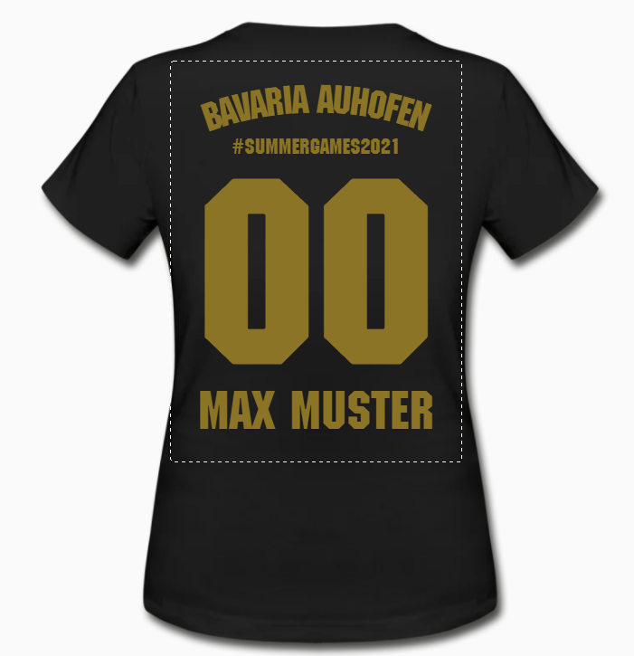
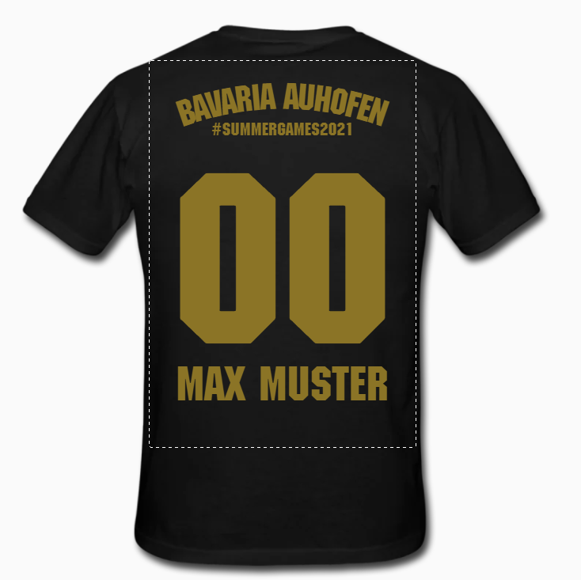

# Sommer Olympiade 2021 | @Auhofen

🕥 25.07.2021 | 10:30 Uhr - 18:00 Uhr *(Alternativ: 01.08.2021)*

📍 Auhofen 1, 85646 Anzing

💸 20 EUR p.P. 

☀️ [Wetter](https://www.wetter.com/wetter_aktuell/wettervorhersage/16_tagesvorhersage/deutschland/anzing/auhofen/DE0000329001.html) | 🌡️ 27&deg; Celsius, 🌧️ 70%, ☀️ 9h

Trikot-Frauen

Trikot-Männer

Bestellt bei https://www.teamshirts.de. Zur [Bestellung](https://my.spreadshirt.de/orders/20661760?authToken=deb2401b18f96b74347b55baff4f256f)

---

## Communication
### #1 Save the date

---

☀️☀️**SAVE THE DATE | Sommerolympiade 2021 ANZING**☀️☀️

Servus zusammen - gemäß den diesjährigen  Olympischen Spiele in Tokyo wird es auch im Kreise des Landkreises Ebersbergs zu einem Showdown der erlesesten Athleten kommen. Das olympische Sportkommittee hat sich dabei einstimmig für den Festlhof in Auhofen als Austragungsort entschieden. Die gegene Infrastruktur ist nach den Worten des Kommittes "unschlagbar".  

Der olympische Gedanke soll dabei auch der Leitgedanke sein. Frei nach dem Motto höher schneller weiter. Dabei werden wir in verschiedene Diszplinen und Spielen miteinander Spaß haben. Ja der Spaß steht im Vordergrund!!! 

Wichtig: Es ist hier kein sportlicher Wettkampf, sondern es geht auch um andere "Skills". Geschicklichkeit, Wissen, Schlagfertigkeit usw. Es wird viel draußen stattfinden. 

***Wann***   
**25.07.2021 | Start 10:30 Uhr** (Bei schlechtem Wetter ist der Ausweichtermin ist der 01.08.2021)

***Wo***  
**Festlhof**, (Auhofen 1, 85646 Anzing) 

***Preis***  
Damit auch ein entsprechender Preis sowie Verpflegung für die Athleten gesichert sind, fände ich es klasse, wenn sich jeder mit 20 EUR an der Durchführung beteiligt.

***Ausrüstung***
- Sportkleidung, Sportschuhe (ggf. Wechselkleidung)
- Badekleidung
- Motivation, Spaß und gute Laune

Bitte gebt mir Bescheid, ob ihr dabei seid. Auf Wunsch habe ich jetzt erstmal keine anderen Leute mehr eingeladen - wir wären also "unter uns" ;) Wenn ihr aber noch jemanden dazu nehmen wollt, sagt mir gerne Bescheid.

Bitte meldet mir bis spätestens 14.07.2021 EOB, ob ihr dabei seid: 

🏟️ = Logisch bin ich dabei!!! 20 EUR, passt vollkommen 

🐟 = Bin dabei, lass uns aber bitte nochmal über den Teilnahmeeinsatz sprechen

❌ = Hab da keine Lust drauf, bin deshalb nicht dabei

⏰ = Ich kann leider zeitlich doch nicht 

Freu mich, wenn ihr auch so Bock drauf habt wie ich!!

PS: Wer bis hierhin gelesen hat...hier ist der Domi (hab ein Problem mit meinem Handy)

----
### #2 Setup & Mode
## Participants

### Save
* 🏟️ Dominik Winter (Organisation) | L
* 🏟️ Helena Hartung | S
* 🏟️ Christine Gerold | S
* 🏟️ Lisa Gerold | S
* 🏟️ Johanna Schmidtmann | L
* 🏟️ Constantin Popp | L
* 🏟️ Annika Breitsameter | S
* 🏟️ Michael Bowinzki | M/L
* 🏟️ Andre Germann | M/L
* 🏟️ Felix Popp | L
* 🏟️ Martin Festl | M

### Open
* Lisa Winter (nur am 01.08.2021) | tbd

----

## Organisation, Mode & To-Do's

🧑‍🤝‍🧑 11 Teilnehmer

💰 220,00 EUR

| Budget        | Verwendung  
| ----------    |---------
| 220,00 EUR    | Basis-Budget         
| - 163,92 €    | T-Shirts           
| **-> 56,08 EUR**     | **Restbudget**  

### Competition mode
- Es wird in **2er Teams** gespielt
- 2er Teams werden **ausgelost**
- Es wird immer ein **Mann** und eine **Frau** ein gemeinsames Team bilden
- In jeder Disziplin ist der grundlegenge Modus "**Jeder-gegen-Jeden**"
- Ein **gewonnenes** Spiel bringt **2 Punkte** für das Siegerteam die Gesamtwertung
- Ein **verlorenes** Spiel bringt **keine Punkte** für die Gesamtwertung
- Ein Spiel **untentschieden** bringt **1 Punkt** für beide Mannschaften für die Gesamtwertung

### Timeline

| Zeit      | Dauer           |   Inhalt                             |
| ----------|-----------------| -----------------------------------  |
| 10:30 Uhr | 30 min          | Tagesplanung und Auslosung der Teams |
| 11:00 Uhr | 2,5 h           | Teil 1 - Durchführung der Olympiade  |
| 13:30 Uhr | 30 min          |    Mittagspause & Gemeinsames Essen  |
| 14:00 Uhr |  3:30 h         | Teil 2 - Durchführung der Olympiade  |
| 17:30 Uhr | 30 min          |    Siegerehrung                      |

### Scoreboard

### Games

#### Wikinger Schach
#### Darts
#### Billard
#### Tischtennis
- Gespielt wird Eins-gegen-Eins
- Bei jedem Spiel, spielt Frau gegen Frau und Mann gegen Mann - es finden also immer 2 Spiele statt
- Ein Spiel ist mit 11 Punkten gewonnen - Aufschlagwechsel nach 2 Punkten
- Zuerst wird "um die Angabe" gespielt
- Es muss mit 2 Punkten Abstand gewonnen werden

#### Konsole | Mario Kart
#### Spikeball
#### Aerobie Frisbee
#### Corn-Hole
#### Sockengolf
#### Flasche in Kasten
#### Ringe werfen
#### Boule
#### Geistig anspruchsvolle Spiele

### Besorgungen
- [ ] Seile / Schnüre für Markierungen
- [ ] Spikeball
- [ ] Wasserpistolen / Supersoaker
- [ ] Aerobie Frisbee
- [x] Nintendo 64 (inkl. 4 Controller) @Christine Gerold
- [x] Wikinger Schach @Constantin Popp
- [ ] Trillerpfeife mit Band
- [x] [T-Shirts](https://checkout.teamshirts.de/?paymentTypeId=2681&successToken=15CCECBB-8DD1-48E4-8403-6734E3C5D5E4&affiliate=1247401&directAffiliate=1247401&lang=de&locale=DE&shopId=830295&version=2.85.0&continueShoppingLink=https%3A%2F%2Fwww.teamshirts.de%2Fbasket%2Freset&result=SUCCESS&orderId=20661760&transactionId=21778894&token=BC0C2F55-905B-4E5F-8C32-D731EE2B982E#/spreadshirt)

